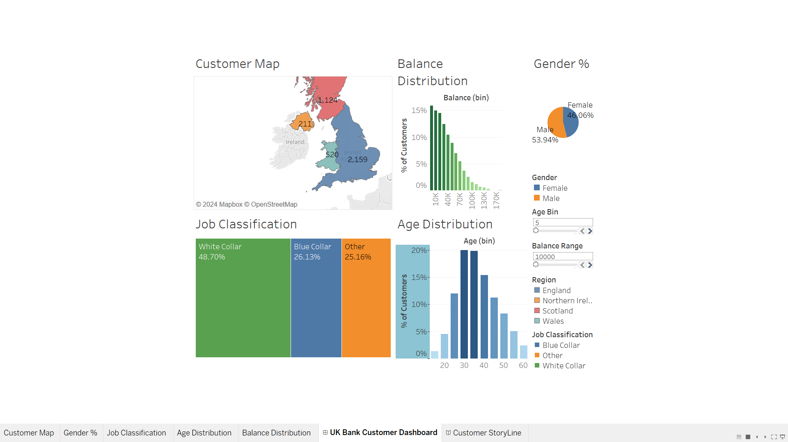
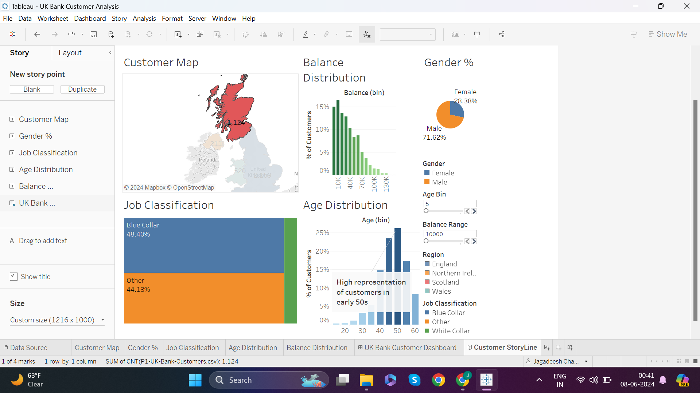
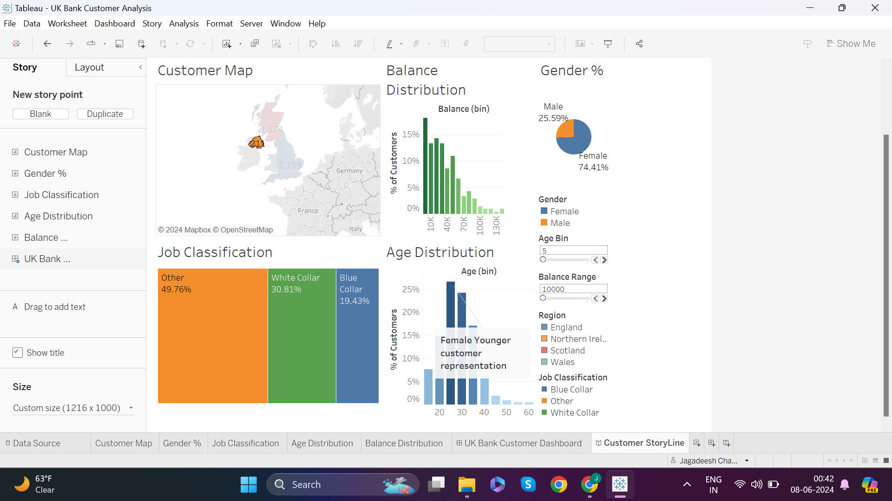
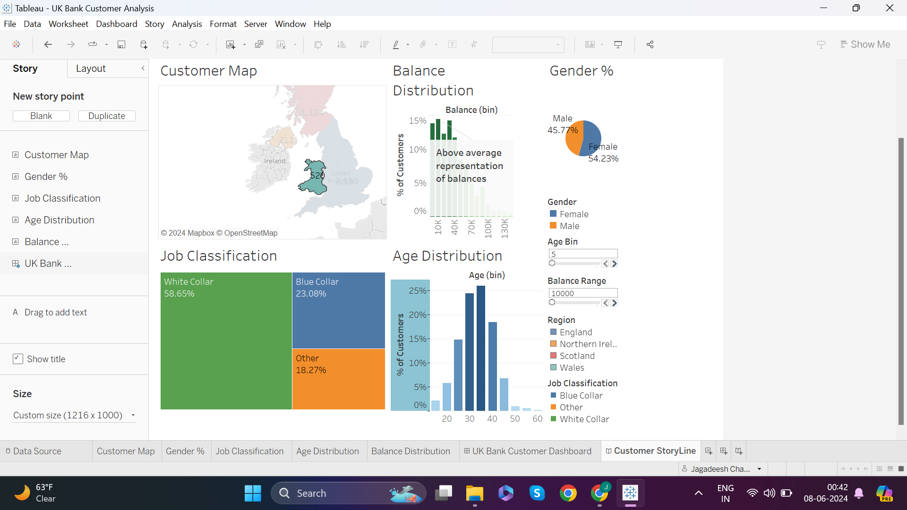

# UK Bank Customer Analysis with Tableau

This repository contains the Tableau workbook and related files for the UK Bank Customer Analysis project. This project aims to analyze and visualize customer data to derive actionable insights for a banking institution.

## Project Overview

The goal of this analysis is to understand the bank's dummy customer base, identify key trends, and support data-driven decision-making. The analysis focuses on customer demographics, account activity, and product usage.

## Data

The dataset includes the following key features:
- **Customer ID**: Unique identifier for each customer.
- **Name**: Customer's name.
- **Age**: Customer's age.
- **Gender**: Customer's gender.
- **Region**: Customer's location.
- **Balance**: Account balance.
- **Job Classification**: Type of job the customer holds.
- **Date of Opening Account**: Date when the account was opened.

You can download the dataset used in this project [here](https://sds-platform-private.s3-us-east-2.amazonaws.com/uploads/P1-UK-Bank-Customers.csv).

## Analysis

The analysis is structured into the following sections:
1. **Customer Demographics**: Insights into the age, gender, and geographical distribution of customers.
2. **Account Activity**: Analysis of account balances, tenure, and activity status.
3. **Product Usage**: Examination of the number of products used by customers and credit card ownership.

## Visualization

The Tableau workbook includes interactive dashboards that allow users to explore:
- Age and balance distribution across different geographies.
- Relationship between Age, balance, and account activity.
- Product usage patterns among different customer segments.

## Key Dashboards

- **Regional Distribution**: Visual representation of customers across England, Wales, Scotland, and Northern Ireland.
- **Age Distribution**: Bar chart showing the distribution of customer ages.
- **Balance Distribution**: Histogram of account balances.
- **Gender Classification**: Pie chart showing the percentage of male and female customers.
- **Job Classification**: Treemap showing the distribution of job types among customers.

## Insights and Recommendations

### General Insights:
- **Age Group**: Most customers are between 30 to 40 years old.
- **Gender**: 54% of customers are male.
- **Balance**: Most customers have balances between 0k to 50k.
  

### Demographic-Based Insights:
#### Scotland
- **Age**: Majority are between 45 to 55 years old.
- **Gender**: 72% are male.
 

#### England
- **Age**: Majority are between 30 to 40 years old.
- **Gender**: Nearly equal male and female distribution.
   

#### Northern Ireland
- **Age**: Majority are between 25 to 30 years old.
- **Gender**: 74% are female.
  

#### Wales
- **Age**: Majority are between 30 to 40 years old.
- **Gender**: 54% are male.
 

## Getting Started

To view and interact with the Tableau dashboards, follow these steps:

1.  Download the tableau workbook uploaded in the repository.
2.  Open the Tableau workbook (`UK Bank's Customer analysis.twbx`) in Tableau Desktop.

## Usage

Use the dashboards to:
- Identify target customer segments for marketing campaigns.
- Understand the distribution of account balances and tenure.
- Explore the relationship between customer demographics and product usage.

## Interact with the Dashboards

You can interact with the worksheets and dashboards directly [here](https://public.tableau.com/app/profile/sunkara.jagadeesh.chandra.prasad/viz/UKBankCustomerAnalysis_17178201675640/CustomerStoryLine).

## Contributing

Contributions are welcome! Please submit a pull request or open an issue to discuss your ideas.

## Acknowledgements

This project is based on the analysis detailed in the Medium article by Baemaek: [Bank Customer Analysis in Tableau](https://medium.com/@baemaek/bank-customer-analysis-tableau-c4c7b7398ff2).
